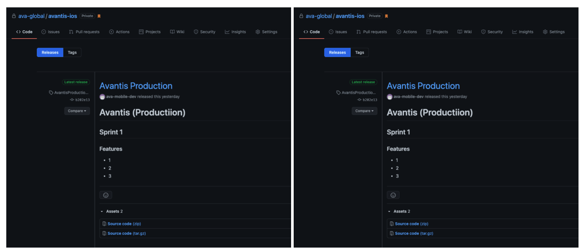
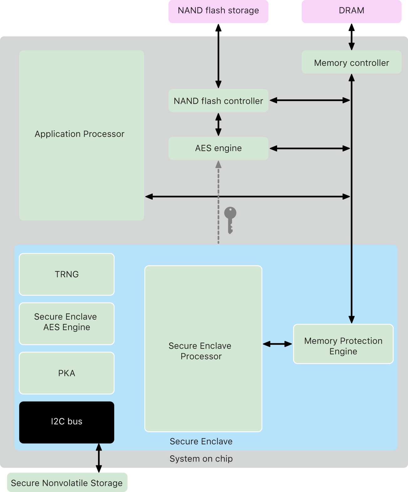

# iOS

## Architecture

### Main architecture (Clean Swift)
xxxxxx

#### Component architecture (MVVM)
xxxx

## CI / CD
### Github Action for CI
### Fatlane Action for CD
### Build Pipeline

### Pipeline State

### Pipeline 1
- On push request (PR)

### Pipeline 2
- On push request (Merged)

### Release & Tags
- Changed Log / Features Note
- Tags (Versioning symmetric https://semver.org)
     

            
## Dependency management
- Cartage
- Cocoapods
- Swift Package Manager

## Tests
- Test monitor (codecov)

- UI tests
- Code coverage (Xcode)

## Crash monitoring
- Firebase Crashlytics    

## Analytics
- Mixpanel
    

## App performance monitoring
    

## Security
 

## Xcode Template

### Clean Architecture Template

#### Scene
- NameViewController.swift
- NamePresenter.swift
- NameInteractor.swift
- NameRouter.swift
- NameFacade.swift
- NameSceneModel.swift
- NameSceneWorker.swift
- Name.storybroad
#### View Component
- NameView.swift
- NameViewModel.swift

## Design Language

- Colors
- Typography 
    - Font
    - Weight
    - Style
- UI Components
    - UI Element
- Line 
- Spacer
- Theme
- Lanuage
- Asset
    - Filename
        - Snake case

## Etc.

- Post Man (API Live Document)
- Project Branch
    - main 
    - develop
- Enviroment
    - Develop
    - Production 
