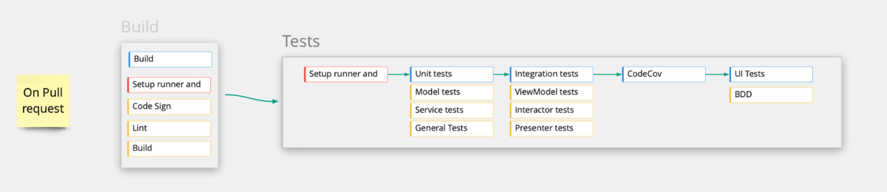
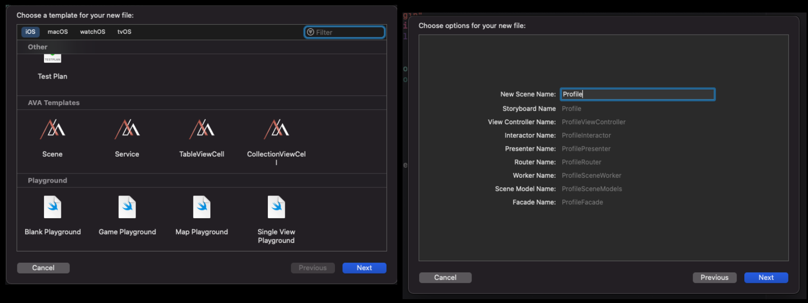
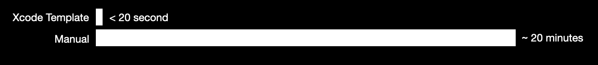

# 🍄 Avantis iOS

## Architecture

### Application main architecture (Clean Swift)

### Card component architecture (MVVM)

## CI / CD

### Github Actions for **CI**

### Fastlane Action for **CD**

### Build Pipeline

### Pipeline State

### Pipeline 1: On push request (PR)

### Pipeline 2: On push request (Merged)

### Release & Tags

* Changed Log / Features Note
* Tags (Versioning symmetric https://semver.org)

## Dependency management

* Cartage
* Cocoapods
* Swift Package Manager

## Tests

* Test monitor (codecov)

* UI tests
* Code coverage (Xcode)

## Crash monitoring: Firebase Crashlytics

## Analytics: Mixpanel

## App performance monitoring

## Security

## Xcode Template

 

### Clean Architecture Template

#### Scene

* NameViewController.swift
* NamePresenter.swift
* NameInteractor.swift
* NameRouter.swift
* NameFacade.swift
* NameSceneModel.swift
* NameSceneWorker.swift
* Name.storybroad

#### View Component

* NameView.swift
* NameViewModel.swift

## Design Language

* Colors
* Typography
  * Font
  * Weight
  * Style
* UI Components
  * UI Element
* Line
* Spacer
* Theme
* Lanuage
* Asset
  * Filename
    * Snake case

## Etc.

* Post Man (API Live Document)
* Project Branch
  * main
  * develop
* Enviroment
  * Develop
  * Production
