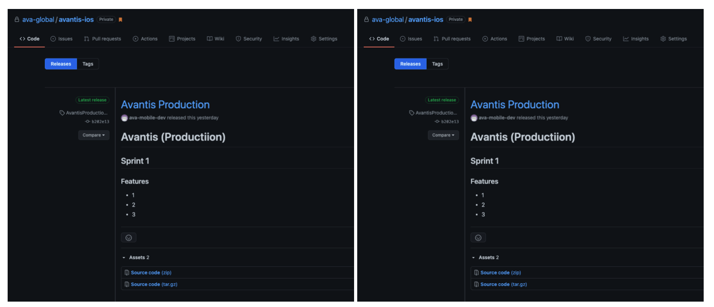

# 🍄 iOS

## Architecture

### Application main architecture (Clean Swift)

The Clean Swift architecture is derived from the Clean Architecture proposed by Uncle Bob. They share many common concepts such as the components, boundaries, and models.

### The VIP Cycle

The view controller, interactor, and presenter are the three main components of Clean Swift. They act as input and output to one another as shown in the following diagram.

### Card component architecture (MVVM)

## Dependency management

* Cartage
* Cocoapods
* Swift Package Manager

## CI / CD

### Github Actions for **CI**

> GitHub Actions is a **continuous integration and continuous delivery** (CI/CD) platform that allows you to automate your build, test, and deployment pipeline. You can create workflows that build and test every pull request to your repository, or deploy merged pull requests to production.

### Fastlane Action for **CD**

> Automate your development and release process fastlane is an open source platform aimed at simplifying Android and iOS deployment. fastlane lets you automate every aspect of your development and release workflow.

### Build Pipeline

### Pipeline State

### Pipeline 1: On push request (PR)

### Pipeline 2: On push request (Merged)

### Release & Tags

* Changed Log / Features Note
* Tags (Versioning symmetric https://semver.org)

## Tests monitor: codecov

* UI tests
* Code coverage (Xcode)

## Security
### Jailbreak detection
- IOSSecuritySuite
### SSL pinning
- public key pinning
### Data security
- [LV.1] General data (user default)
- [LV.2] Credential (keychain)
- [LV.3] Super credential (keychain + secure enclave)

## Xcode Template

> XCode Templates is a tool for creating code snippets to give you a better starting point to achieve your goal. In this tutorial I will walk you through preparing a custom template for MVVM project architecture.

 

### Clean Architecture Template

#### Scene

* NameViewController.swift
* NamePresenter.swift
* NameInteractor.swift
* NameRouter.swift
* NameFacade.swift
* NameSceneModel.swift
* NameSceneWorker.swift
* Name.storybroad

#### View Component

* NameView.swift
* NameViewModel.swift

## Crash monitoring: Firebase Crashlytics

> Never miss a critical app crash with realtime alerts for new issues. Crashes are prioritized by impact on actual users so you know how to best fix bugs. Build Fast For Any Device. Customize Your App. Boost App Engagement. Accelerate Development. 

## Analytics: Mixpanel

> Mixpanel is a business analytics service company. It tracks user interactions with web and mobile applications and provides tools for targeted communication with them. Data collected is used to build custom reports and measure user engagement and retention.

## App performance monitoring

> Firebase Performance Monitoring, a real time app performance monitoring tool, helps you keep a close eye on your app as you roll out new features or make configuration changes. Performance Monitoring also gives you control over your performance data with a customizable dashboard that makes it easy to focus on your most important metrics.

**Keep your app fast and responsive**

> Gain insight into how your app performs from your users' point of view with a breakdown of trace and network data into dimensions like app version, country, device, and network type.

**Capture health and performance of network requests**

> Stay on top of your app's dependencies, network latencies, and errors affecting your users with automated monitoring of HTTP/S requests. You can also customize URL patterns to closely monitor response times, success rates, and payload sizes of your critical requests.

**Reduce troubleshooting and resolution time**

Understand the context in which performance issues take place and more easily address them using custom traces. You can also make use of automated traces, such as app startup time.

## Design Language

* Colors
* Typography
  * Font
  * Weight
  * Style
* UI Components
  * UI Element
* Line
* Spacer
* Theme
* Lanuage
* Asset
  * Filename
    * Snake case

## Etc.

* Post Man (API Live Document)
* Project Branch
  * main
  * develop
* Enviroment
  * Develop
  * Production
